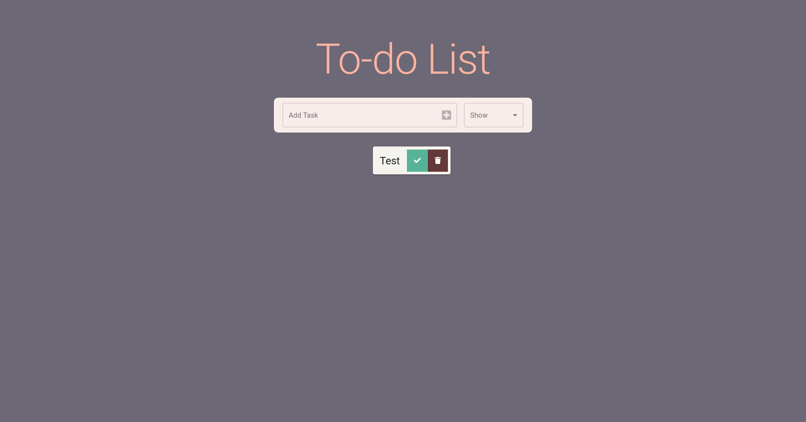

# To-do List React App ✔️📋

__Hola! Esta es una app web para generar una to-do list.__

__Podés verla (o usarla) haciendo click [acá](https://melicantamutto.github.io/to-do-list/).__

__Este proyecto fue creado con [Create React App](https://github.com/facebook/create-react-app).__

## Instalación 🔧

Para clonar este repositorio tenés que:

- Ir la [página](https://github.com/melicantamutto/matcheadas)

- Hacer click en 

- Hacer click en el botón Code y copiar la url

- Y luego en tu terminal de git (situandote en la carpeta deseada) escribir

   ` git clone <url>`

- Entrar en la carpeta del proyecto y abrirlo en tu IDE

## Scripts Disponibles

En el directorio del proyecto podés ejecutar:

### `npm start`

Runs the app in the development mode.\
Open [http://localhost:3000](http://localhost:3000) to view it in the browser.

The page will reload if you make edits.\
You will also see any lint errors in the console.

### `npm test`

Launches the test runner in the interactive watch mode.\
See the section about [running tests](https://facebook.github.io/create-react-app/docs/running-tests) for more information.

### `npm run build`

Builds the app for production to the `build` folder.\
It correctly bundles React in production mode and optimizes the build for the best performance.

The build is minified and the filenames include the hashes.\
Your app is ready to be deployed!

See the section about [deployment](https://facebook.github.io/create-react-app/docs/deployment) for more information.

### `npm run eject`

**Note: this is a one-way operation. Once you `eject`, you can’t go back!**

If you aren’t satisfied with the build tool and configuration choices, you can `eject` at any time. This command will remove the single build dependency from your project.

Instead, it will copy all the configuration files and the transitive dependencies (webpack, Babel, ESLint, etc) right into your project so you have full control over them. All of the commands except `eject` will still work, but they will point to the copied scripts so you can tweak them. At this point you’re on your own.

You don’t have to ever use `eject`. The curated feature set is suitable for small and middle deployments, and you shouldn’t feel obligated to use this feature. However we understand that this tool wouldn’t be useful if you couldn’t customize it when you are ready for it.

## Leer más

Podés leer más sobre el tema en la [documentación de Create React App](https://facebook.github.io/create-react-app/docs/getting-started).

Para aprender sobre React, chequea la [documentación de React](https://reactjs.org/).

### Así se debería ver el proyecto

***

## Construido con ⌨️

- [React](https://reactjs.org/)
- [Material UI](https://material-ui.com/)

***

## Agradecimientos 💕

- A mi profe [Jonh](https://github.com/Jonhks)
- Si te gustó y lo queres compartir, te agradeciría muchisimo.